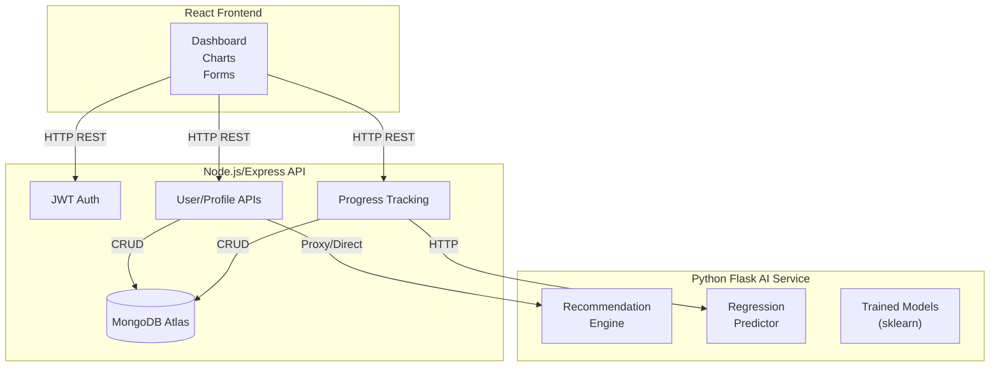
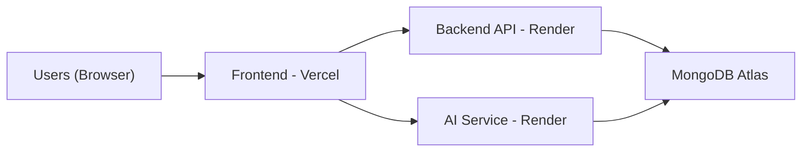

# 🏗️ System Architecture

## 🎨 High-Level Overview



## 🔍 Component Breakdown

### 1. **Frontend (React 18 + Vite)**
| Component | Features | Libraries |
|-----------|----------|-----------|
| Landing/Auth | Hero, Forms, JWT | Tailwind, React Router |
| Dashboard | Sidebar, Cards | Framer Motion |
| Charts | Interactive Graphs | Chart.js |
| Theme | Dark/Light | Context API |

### 2. **Backend API (Node/Express)**
```
Routes:
/auth/register | /auth/login
/user/profile
/progress/log
/ai/recommend-diet (proxy)
```
- **Security**: JWT middleware, bcrypt
- **Validation**: express-validator
- **CORS**: For frontend + AI

### 3. **AI Microservice (Python/Flask)**
```
Endpoints:
/recommend-diet?calories=2000&amp;veg=true
/recommend-workout?goal=loss&amp;bmi=27
/predict-weight?history=[...]
```
- **Models**:
  - `calorie_needs.py`: Harris-Benedict formula
  - `workout_recs.py`: Rule-based + KNN
  - `weight_predictor.pkl`: LinearRegression (trained on synthetic data)
- **Explainable**: JSON with `reasoning` field

### 4. **Database Schema (MongoDB)**
```javascript
User: { _id, email, profile: {age,height,weight,gender,goal}, createdAt }
Progress: { userId, date, weight, caloriesIn, caloriesBurned, workoutDone }
DietPlan: { userId, date, meals: [...] }
WorkoutLog: { userId, date, exercises: [...] }
```

## 🌐 Data Flow Example
```
1. User signup → Profile → BMI calc (frontend)
2. Profile → Backend → AI "/recommend" → Diet/Workout plans
3. Daily log → Backend → Progress save
4. Weekly → AI "/predict" → Adjustment suggestions
5. Charts fetch progress history
```

## 🚀 Deployment Architecture


## 🔐 Security Layers
1. **Frontend**: Input sanitization
2. **Backend**: JWT, rate-limiting, helmet
3. **Database**: Atlas IP whitelist
4. **AI**: API key (optional)

## 📊 Performance
- **Latency**: <200ms API calls
- **Scalability**: Stateless services, horizontal scaling
- **Charts**: Client-side rendering (Chart.js)

**This architecture demonstrates enterprise-level design suitable for BCA major project evaluation.**

